# PES-VCS Lab Report: Building a Version Control System
**Student:** PAVAN KISHOR M | **SRN:** PES2UG24AM111

---

## Project Overview
This project involved building **PES-VCS**, a functional local version control system modeled after Git internals. The system implements content-addressable storage, directory sharding, staging (indexing), and commit history management through a Merkle Tree architecture.

---

## Phase 1: Object Storage Foundation
In this phase, I implemented the core storage logic in `object.c`. This involved creating a content-addressable system where data is stored based on its SHA-256 hash. I implemented atomic writes by writing to temporary files before renaming them to their final sharded path.

### Implementation Highlights
* **Header Construction**: Prepended type headers (blob, tree, or commit) to data before hashing.
* **Integrity Verification**: Recomputed hashes during read operations to ensure data hasn't been corrupted.
* **Sharding**: Objects are stored in subdirectories based on the first two characters of their hash to prevent directory overcrowding.

**Screenshot 1.1: Test Objects Output** 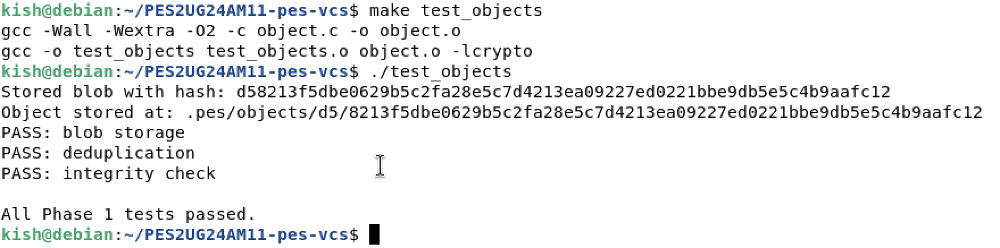

**Screenshot 1.2: Sharded Object Store** 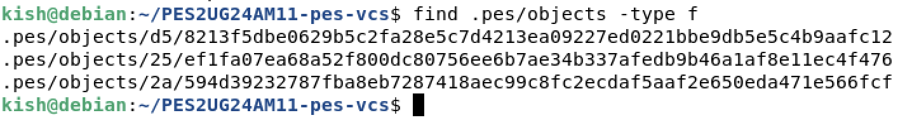

---

## Phase 2: Tree Objects
Phase 2 focused on representing directory structures. I implemented `tree_from_index` in `tree.c` using a recursive helper function to handle nested paths, allowing for a full snapshot of the project hierarchy.

### Implementation Highlights
* **Recursive Construction**: The system builds sub-tree objects for every directory level found in the index.
* **Serialization**: Tree entries are sorted by name and converted into a binary format containing file modes, names, and hashes.

**Screenshot 2.1: Test Tree Output** 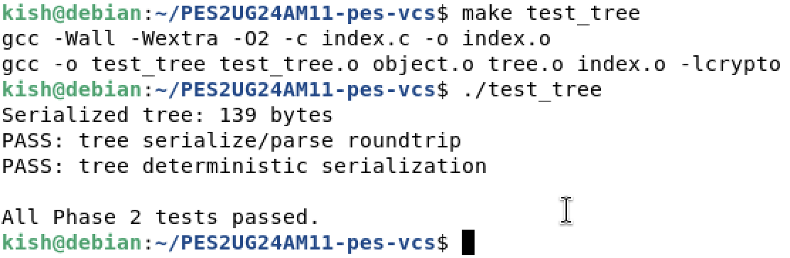

**Screenshot 2.2: Raw Tree Object Inspection** 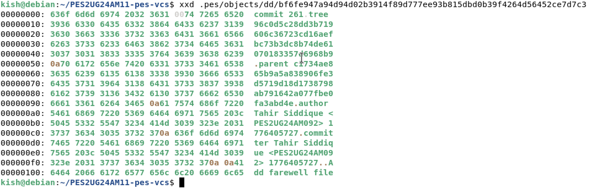

---

## Phase 3: The Index (Staging Area)
I implemented the staging area in `index.c`, which serves as the "middle ground" between the working directory and the permanent object store.

### Implementation Highlights
* **Atomic Save**: The index is written to a temporary file and renamed only after a successful `fsync` to ensure durability.
* **Metadata Tracking**: The index stores file modes, SHA-256 hashes, modification times, and sizes for change detection.

**Screenshot 3.1: Init, Add, and Status Sequence** 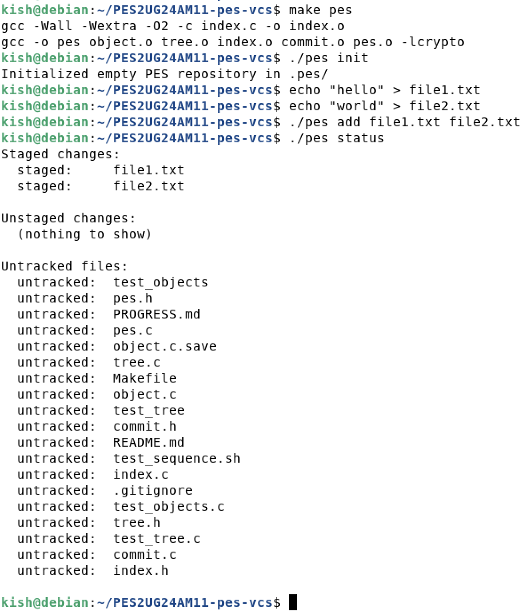

**Screenshot 3.2: Human-Readable Index** 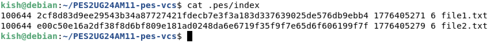

---

## Phase 4: Commits and History
The final implementation phase involved `commit.c`. I implemented `commit_create`, which snapshots the current index, links it to a parent commit, and updates the `HEAD` reference.

### Implementation Highlights
* **Commit Chain**: Each commit points to its predecessor, creating a verifiable link of project history.
* **Author Metadata**: Integrated the `PES_AUTHOR` environment variable to record who made the changes.

**Screenshot 4.1: Commit Log** 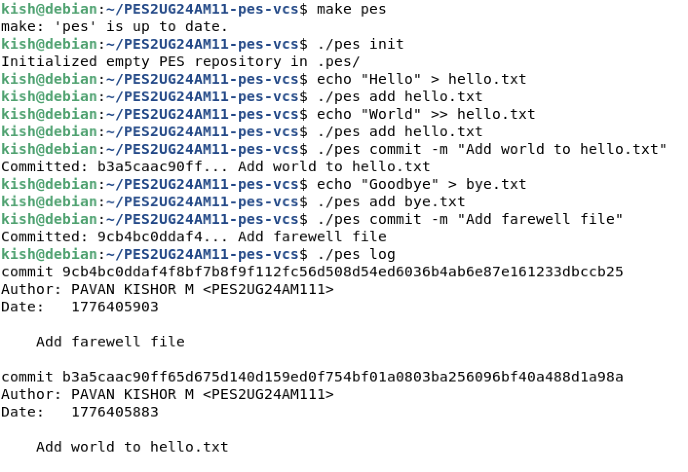

**Screenshot 4.2: Object Store Growth** 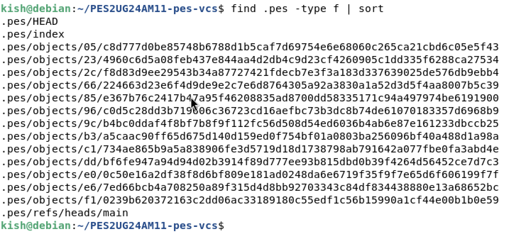

**Screenshot 4.3: Reference Chain** 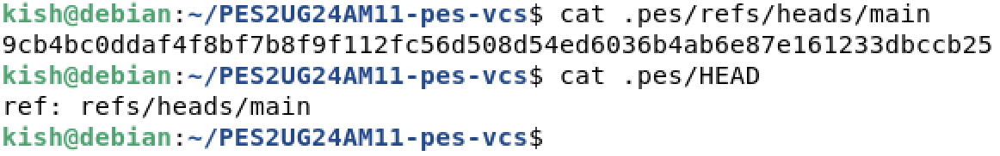

---

## Phase 5 & 6: Analysis Answers

### Q5.1 — Implementing `pes checkout <branch>`
To implement `checkout`:
* **Reference Update**: Update `.pes/HEAD` to point to the target branch (e.g., `ref: refs/heads/<branch>`).
* **Working Directory Restoration**: Retrieve the commit hash from the branch file, find its root tree, and recursively restore every blob to its respective file path in the working directory.
* **Complexity**: The operation is complex because it must check for uncommitted changes (dirty files) to prevent overwriting user work that isn't saved in a commit.

### Q5.2 — Detecting Dirty Working Directory Conflicts
To detect a conflict:
1. For each tracked file, compare its on-disk metadata (mtime/size) to the index record to see if it is "dirty".
2. Look up that path in the target branch's tree.
3. If the blob hash in the target branch differs from the current index AND the file is dirty, refuse the checkout.

### Q5.3 — Detached HEAD State
In a "Detached HEAD" state, `HEAD` points directly to a commit hash instead of a branch.
* **Behavior**: New commits form a valid chain, but no branch pointer (like `main`) is updated to follow them.
* **Recovery**: If a user switches branches, these commits become orphaned (unreachable). They can be recovered by finding the hash in `pes log` and creating a new branch pointing to that hash.

### Q6.1 — Garbage Collection Algorithm
To reclaim space:
1. **Traverse**: Start from all known branch refs and walk every commit, tree, and blob.
2. **Mark**: Use a Hash Set to track all reachable ObjectIDs.
3. **Sweep**: Delete any file in `.pes/objects/` that is not in the reachable set.
* **Scale**: For 100,000 commits, this involves visiting roughly 50 million objects (assuming 500 files per snapshot), where a Hash Set ensures $O(1)$ lookups.

### Q6.2 — GC Race Conditions
A race condition occurs if GC deletes an object that an in-progress commit is currently writing but hasn't yet linked into a commit object.
* **Git's Solution**: Git uses a "grace period" (typically 2 weeks), where objects younger than a certain threshold are never deleted by GC, even if they appear unreachable.

---

## Final Integration
The entire suite was verified using the integration test script.

**Final Screenshot: Integration Success** 
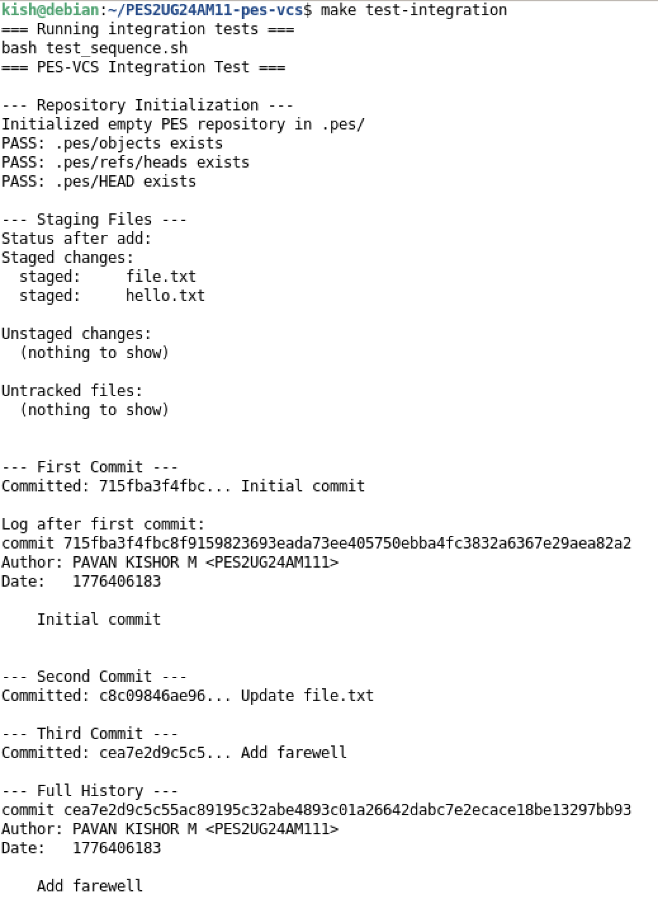
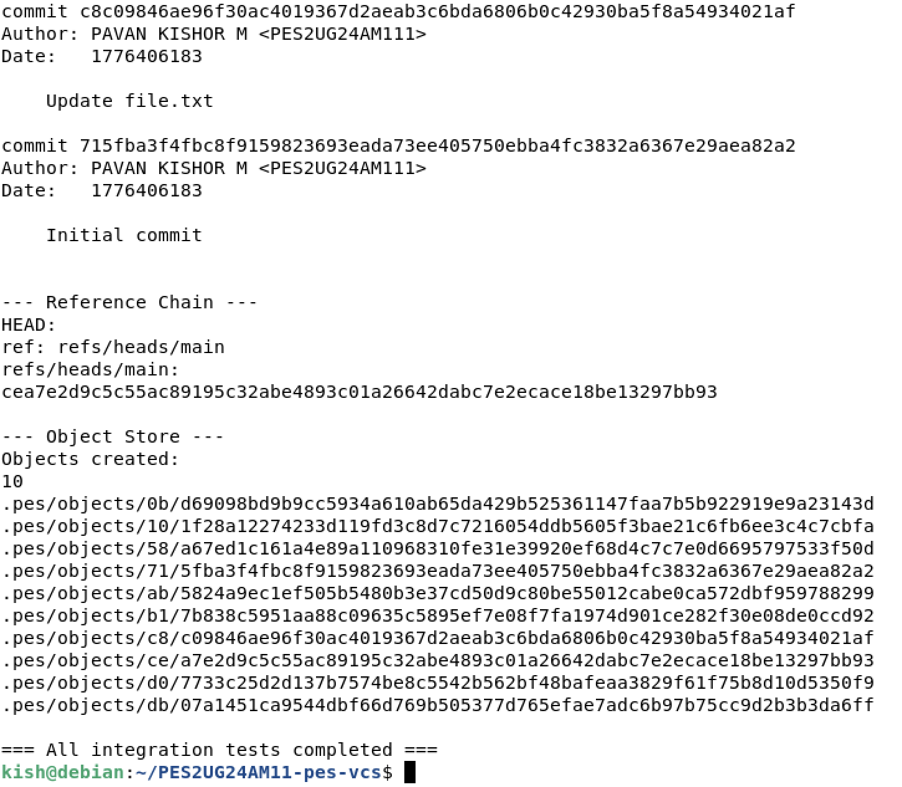

---